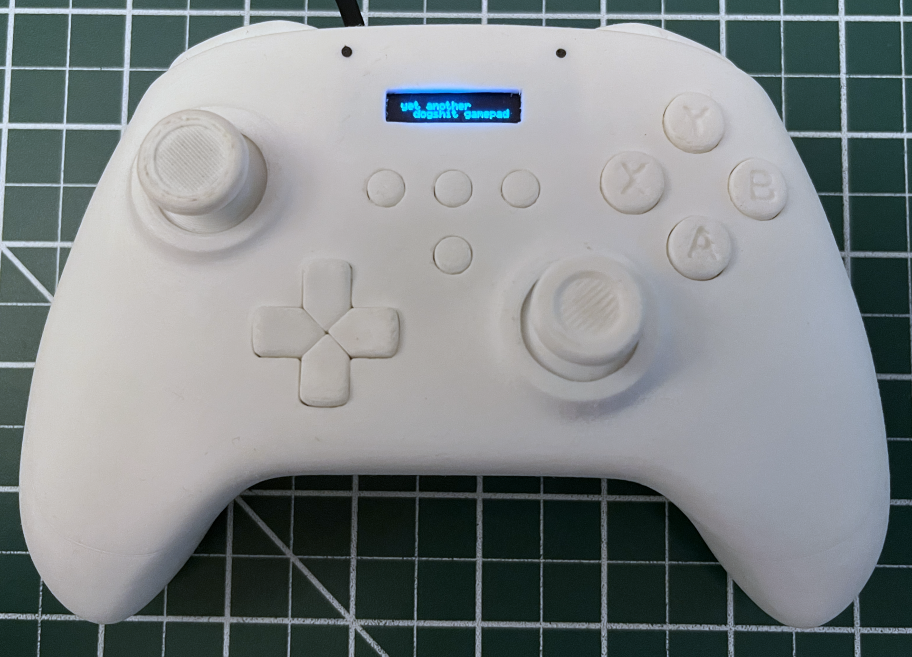
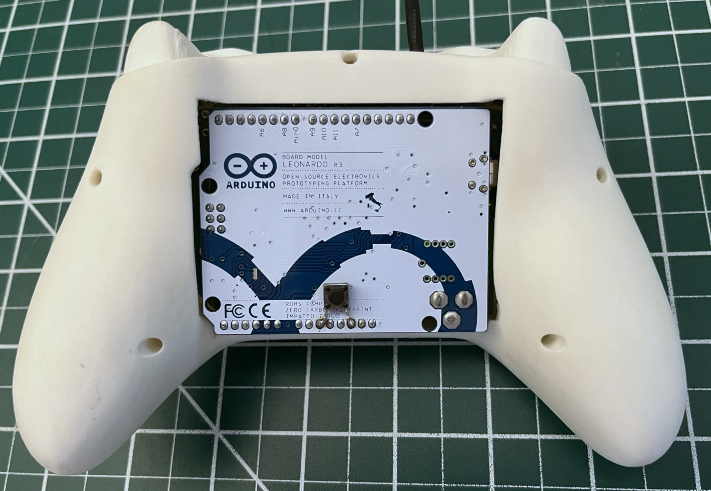

# Yet Another Dogshit Gamepad
YADG is an open source gamepad built on the Arduino platform.
## Features
- 1000hz polling rate
- Polar joystick input
- Curve map
- Configurable deadzones
- Button remapping
- Button debounce settings
- idk what people care about lol
## Images

